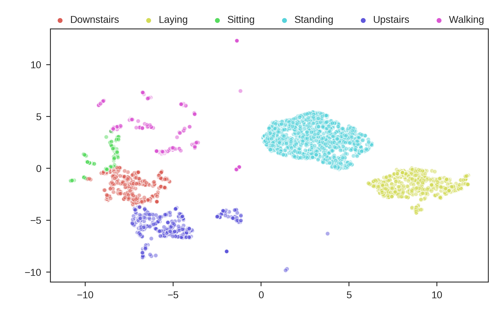
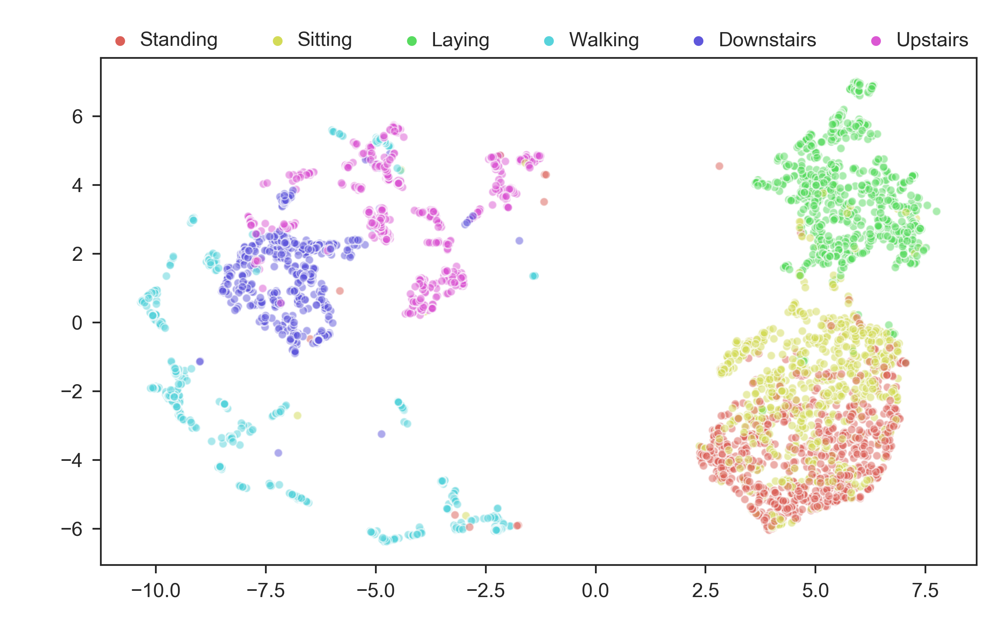

Getting started
========================

Here we will talk about getting started with N2D so you can get clustering!!

Installation
--------------

N2D is on Pypi and readily installable ::

        pip install n2d

Loading Data
----------------

N2D comes with **5** built in datasets: 3 image datasets and two time series datasets, described below:

* MNIST
  - **Description**: Standard handwritten image dataset. 10 classes
* MNIST-Test
  - **Description**: Test set of MNIST. 10 classes
* MNIST-Fashion
  - **Description**: Pictures of articles of clothing, similar to MNIST but much more difficult. 10 classes
* Human Activity Recognition (HAR)
  - **Description**: Time series of accelerometer data, used to determine whether the recorded human is sitting, walking, going upstairs/downstairs etc. 6 classes
* Pendigits
  - **Description**: Pressure sensor data of humans writing. Used to determine what number the human is writing. 10 classes

To actually load the data, we import the datasets from n2d, shown below along with the data import functions and their outputs ::

       from n2d import datasets as data

       # imports mnist
       data.load_mnist() # x, y 

       # imports mnist_test
       data.load_mnist_test() # x, y

       # imports fashion
       data.load_fashion() # x, y, y_names

       # imports HAR
       data.load_har() # x, y, y_names

       # imports pendigits
       data.load_pendigits # x, y

In this example, we are going to use HAR. ::

        x, y, y_names = data.load_har()

Building the model
---------------------

To build an N2D model, we are going to need 2 pieces: an autoencoder, and a manifold clustering algorithm. Both are provided with the library thankfully! First, we will load up any libraries we want to use in this example:::

        
      import n2d
      import matplotlib
      import matplotlib.pyplot as plt
      import seaborn as sns
      plt.style.use(['seaborn-white', 'seaborn-paper'])
      sns.set_context("paper", font_scale = 1.3)
      matplotlib.use('agg')
      np.random.seed(0)

      from n2d import datasets as data
      # load in the data
      x, y, y_names = data.load_har()

The first step of any not too deep clustering procedure is the autoencoded embedding. Therefore, we will initialize that first. We do this with the AutoEncoder class:

The AutoEncoder Class
~~~~~~~~~~~~~~~~~~~~~~~~~

So lets go ahead and initialize the autoencoder. This again uses the N2D AutoEncoder class:::
        
        n_clusters = 6
        latent_dim = n_clusters

        ae = n2d.AutoEncoder(x.shape[-1], latent_dim)
        

In the simplest possible example, this is it! The Autoencoder class **requires** the input dimensions of the data, and the number of dimensions we would like to reduce that to (latent dimensions, embedding dimensions). We can also modify the internal architecture of the AutoEncoder with the **architecture** argument. By default, the shape of the **encoder** is *[input_dim, 500, 500, 2000, latent_dim]* and the shape of the **decoder** is *[latent_dim, 2000, 500, 500, input_dim]*, or the reverse of the encoder. The autoencoder consists of these two ends stacked together, giving a network with dimensions: *[input_dim, 500, 500, 2000, latent_dim, 2000, 500, 500, input_dim]*. The shape of the network in between the input and latent dimensions can be replaced with a list, for example if we wanted the first three layers of the encoder to be 2000 neurons, and the next 4000 we would say (expecting the decoder to be the reverse of this):::

        ae_huge = n2d.Autoencoder(x.shaep[-1], latent_dim, architecture = [2000, 2000, 2000, 4000])

We can also change the activation function of our hidden layers by specifying **act**. Below is a table of all the parameters for AutoEncoder:

.. list-table:: n2d.AutoEncoder Arguments
        :widths: 25 25 25
        :header-rows: 1

        * - Argument
          - Default
          - Description
        * - input_dim
          - no default
          - The data's dimensions, typically data.shape[-1]
        * - latent_dim
          - 10
          - Number of dimensions you wish to represent the data in with the autoencoder
        * - architecture
          - [500, 500, 2000]
          - The layout of the hidden layers in the network, presented in list form
        * - act
          - 'relu'
          - The activation function for the hidden layers of the network
        * - x_lambda
          - lambda x: x
          - Function used to transform the inputs to the network, but hold the outputs constant

It is important to note that while we set the latent dimensions to be the same as the number of clusters, this is not a `hard and fast rule <https://github.com/rymc/n2d/issues/5#issuecomment-574688767>`_. Use your head and some sense when choosing dimensions!

The next step in Not Too Deep clustering is to learn the manifold in the embedding and cluster that. In the original paper describing N2D, UMAP and Gaussian mixing performed the best, and therefore are implemented in the library. To do this, we use the UmapGMM class (replacing the autoencoder/manifold learner/clustering algorithm will be discussed in the next chapter).

Clustering the Embedded Manifold: UmapGMM
~~~~~~~~~~~~~~~~~~~~~~~~~~~~~~~~~~~~~~~~~~

Lets talk a bit more about how we learn the manifold and cluster it!! This is done primarily with the UmapGMM object ::
        
        manifoldGMM = n2d.UmapGMM(n_clusters)

This initializes the hybrid manifold learner/clustering arguments. In general, UmapGMM performs best, but in a later section we will talk about replacing it with other clustering/manifold learning techniques. The arguments for UmapGMM are shown below:

.. list-table:: UmapGMM Arguments
        :widths: 25 25 25
        :header-rows: 1

        * - Argument
          - Default
          - Description
        * - n_clusters
          - no default
          - The number of clusters
        * - umap_dim
          - 2
          - Number of dimensions of the manifold.
        * - umap_neighbors
          - 10
          - Number of nearest neighbors to consider for UMAP. Defaults to 10, to recreate cutting edge results shown in the paper, however often 20 is a better value 
        * - umap_min_distance
          - float(0)
          - Minimum distance between points within the manifold. Smaller numbers get tighter, better clusters while larger numbers are better for visualization
        * - umap_metric
          - 'euclidean'
          - The distance metric to use for UMAP.
        * - random_state
          - 0
          - The random seed

For our use case, there are two main tunables: **umap_dim**, and **umap_neighbors**. **umap_dim** is the number of dimensions you wish to project the autoencoded embedding in. In general, values between **2** and **the number of clusters** are acceptable. It is best to start at 2 (the default value) and then go up from there. All of the breakthrough results in the paper were done with umap_dim =2.  **umap_neighbors** is the number of nearest neighbors UMAP will use when constructing its KNN graph. In the case of N2D, this should be a small value, as we want to learn the **local manifold**. The default value for umap_neighbors is **10**, as it will allow you to reproduce the results in the paper, however umap_neighbors = **20** sometimes performs slightly better, *especially if the autoencoder loss is high*. Since umapGMM takes just a few seconds to run, it is worth it to tune these two values in general.

Finally, we are ready to get clustering!

Initializing N2D
~~~~~~~~~~~~~~~~~~~~~~~~~
Next, we initialize the **n2d** object. We feed it first an autoencoder, and second a manifold clusterer:::
        
        harcluster = n2d.n2d(ae, manifoldGMM)

and that's it! Now we can fit and predict!

Learning an Embedding
~~~~~~~~~~~~~~~~~~~~~~~~~~~~~~~

Next, we need to train the autoencoder to learn the embedding. This step is pretty easy. As this is our first run of the autoencoder, the only thing we need to input is the name we would like the weights to be stored under, as well as create a weights directory. ::
        

        harcluster.fit(x, weight_id = "weights/har-1000-ae_weights.h5")

This will train the autoencoder, and store the weights in **weights/[WEIGHT_ID]-[NUM_EPOCHS]-ae_weights.h5**. The arguments to the preTrainEncoder method are shown in the table below:

.. list-table:: fit Arguments
        :widths: 25 25 25
        :header-rows: 1

        * - Argument
          - Default
          - Description
        * - batch_size
          - 256
          - The batch size
        * - epochs
          - 1000
          - number of epochs
        * - loss
          - "mse"
          - The loss function. Anything that tf.keras accepts will do.
        * - optimizer
          - "adam"
          - The optimizier
        * - weights
          - None
          - The name of the weight file. If None, the model will be trained
        * - verbose
          - 0
          - The verbosity of the training
        * - weight_id
          - None
          - if None, the encoder weights will not be saved. If string, it will save the weights to that file path
        * - patience
          - None
          - int or None. If None, nothing special happens, if int, the tolerance for early stopping

Please note the patience parameter! It can save lots of time. Also please note, if you do not tell N2D where to save the model weights, it will not save them!!

On our next round of the autoencoder, while we fiddle with clustering algorithms, visualizations, or whatever, we can use the preTrainEncoder method to load in our weights as follows. ::
        
        harcluster.fit(x, weights = "weights/har-1000-ae_weights.h5")

Finally, we can actually cluster the data! To do this, we pass the clustering mechanism into the N2D predict method. ::
        
        preds = harcluster.predict(x)

This will save the prediction internally and externally (for visualization convenience).
The prediction is internally stored in ::

        harcluster.preds

for your convenience if you want to access the predictions for plotting/further analysis

fit_predict
~~~~~~~~~~~~~~~~~~~~~~~~~~~~~~

We can wrap these two commands into one using the fit_predict method, which takes the same arguments as fit::
        
        harcluster.fit_predict(x, weight_id = "weights/har-1000-ae_weights.h5")

Assessing and Visualization
~~~~~~~~~~~~~~~~~~~~~~~~~~~~~~~~

To assess the quality of the clusters, you can A) use some custom assessment method on the predictions or B) if you have labels run ::
        
        harcluster.assess(y)
        # (0.81212, 0.71669, 0.64013) 

This prints out the cluster accuracy, NMI, and ARI metrics for our clusters. These values are top of the line for all clustering models on HAR. 

To visualize, we again have a built in method as well as tools for creating your own visualizations: 

**Built in**::

        harcluster.visualize(y, y_names, n_clusters = n_clusters)
        plt.show()

**Custom** :

We need a few things for a visualization: The embedding and the the predictions. The embedding is stored in ::
        
        harcluster.hle

You typically want to plot the embedding as x and the clusters as y! Lets also check out what our clusters look like!

These are the predicted clusters, now lets look at the real groupings!

Looks like we did a pretty good job!! One very interesting thing to note, is even though it got some things wrong, where it got them wrong is still useful. The stationary activities are all near each other, while the active activities are all together. N2D, with no features and labels, not only found useful clusters, but ones that provide real world intuition! This is a very powerful result.

Predicting on new data
---------------------------------

Once the everything has been fitted, we can easily make fast predictions on new data::
        
        x_test, y_test = data.load_mnist_test()
        new_preds = harcluster.predict(x_test)

This will use the autoencoder to map the data into the proper number of dimensions, and then transform it to the manifold learned during fitting, and finally cluster it using the trained clustering mechanism. 

Saving and Loading
-----------------------------------

N2D models can be saved for deployment with the **save_n2d** and the **load_n2d** functions. Currently, this is managed by saving the **encoder** to an h5 file, and pickling the **manifold clusterer**. This is an open option area for development, ideally the whole model will be serialized in an h5 file. If you wish to contribute, please see the `issue <https://github.com/josephsdavid/N2D/issues/5>`_. To save an n2d model, follow the following procedure::

        n2d.save_n2d(harcluster, encoder_id='models/har.h5', manifold_id='models/hargmm.sav')

to load, we follow a similar mechanism:::

        hcluster = n2d.load_n2d('models/har.h5', 'models/hargmm.sav')

Please note that **for rapid development and experimentation** you should use the **weight saving** in the *.fit* method, as that is its intended use. You can train the network and then fiddle around with the rest of the model. This means that **save_n2d** and **load_n2d** should **only be used for deploying the model**.

